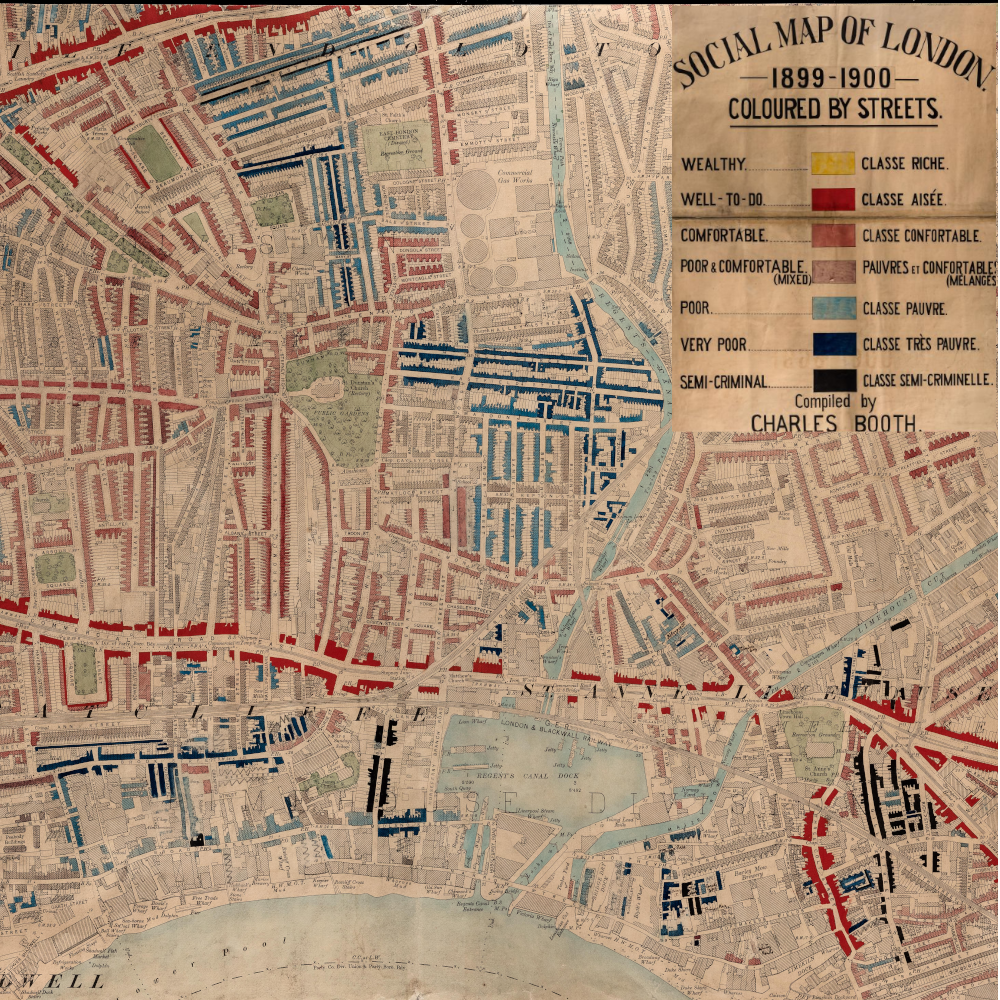

# Key Geographic Concepts

Before we talk too much about the impressive things we can do with geographic data science, we need to cover some fundamentals.

## The power of maps

In recent years, we've experienced the power of the digital mapping revolution.

:::: {.columns}

::: {.column width='70%'}


:::

::: {.column width='30%'}

It's now entirely normal to us that we can generate routes in seconds, with accurate travel times, traffic data, points of interest...

:::

::::

## Placeholder

But are we reaping the benefits of this digital mapping revolution in NHS analytics and service planning yet?

## The past...


:::: {.columns}

::: {.column width='30%'}

This was revolutionary!

:::

::: {.column width='70%'}

{.lightbox height=600}

:::

::::


## Maps

The digital age makes it possible to use and obtain rich geographic data, and make maps

:::: {.columns}

::: {.column width='33%'}
::: {.value-box icon="fa-solid fa-forward-fast"}
(More) quickly
:::

:::

::: {.column width='33%'}
::: {.value-box icon="fa-solid fa-robot"}
Routinely / in automated reports
:::

:::

::: {.column width='33%'}
::: {.value-box icon="fa-solid arrow-pointer"}
Interactively (where appropriate)
:::
:::

::::


## Kinds of Maps and Geographic data

But you might not have thought much about the different kind of maps that exist since you last did a geography lesson at school!

::: {.value-box align="center" font-size="200%"}
Knowing what's possible helps you to request the right analyses and critically analyse what is produced.
:::

This forms a crucial lens for evaluating more advanced location work.

## Point Maps {.nostretch}

<div style="font-size: 65%">

Point maps tell us where useful things are, like existing resources (hospitals, GP surgeries).

</div>

::: {.map-container style="height: 450px; width: 100%;"}
```{python}
#| label: simple-point-map
from lokigi.site import SiteProblem
import folium

problem_simplest = SiteProblem()
problem_simplest.add_sites("data/devon_healthcare_facilities.csv", candidate_id_col="Facility_Name", horizontal_geometry_col="Longitude", vertical_geometry_col="Latitude", crs="EPSG:4326")
problem_simplest.add_region_geometry_layer("data/LSOA_Devon_2021_EW_BSC_V4.gpkg", common_col="LSOA21NM")

fig = folium.Figure(height=550)
m = folium.Map(
    location=[50.75, -3.75], zoom_start=9, tiles="CartoDB Positron"
).add_to(fig)

problem_simplest.plot_sites(interactive=True, m=m)
```
:::

## Point Maps - Enhancements {.nostretch}

<div style="font-size: 65%">
And we can do quite a lot with them to make them more useful!
</div>


```{python}
#| echo: false
#| output: true
#| label: fancy-point-map
from plotting_helpers import fancy_point_map
fancy_point_map(problem_simplest, height=600)
```


## Choropleths

<div style="font-size: 65%">
Choropleths allow us to understand statistics about areas.
</div>


```{python}
#| label: setup-main-problem
problem = SiteProblem()
problem.add_sites("data/devon_mius.geojson", candidate_id_col="Facility_Name")
problem.add_region_geometry_layer("data/LSOA_Devon_2021_EW_BSC_V4.gpkg", common_col="LSOA21NM")
problem.add_demand("data/demand_MF_50_84.csv",     demand_col="MF50-84 Percentage of Total LSOA Population",
    location_id_col="LSOA 2021 Name")
problem.add_travel_matrix("data/devon_miu_travel_matrix.csv", source_col="from_id")
problem.add_equity_data(
    "data/devon_imd_2025_2021_LSOAs.csv",
    equity_col="Index of Multiple Deprivation (IMD) Decile (where 1 is most deprived 10% of LSOA",
    common_col="LSOA name (2021)",
    label="Indices of Multiple Deprivation",
    continuous_measure=True,
    reverse=False
    )
```

```{python}
#| label: plot-choropleth
fig = folium.Figure(height=550)
m = folium.Map(
    location=[50.75, -3.75], zoom_start=9, tiles="CartoDB Positron"
).add_to(fig)
problem.plot_region_geometry_layer(plot_demand=True, interactive=True, cmap="viridis", m=m)
```

## Choropleths + Points

<div style="font-size: 65%">
And one of the most powerful things we can do is combine the two!
</div>

```{python}
#| label: plot-choropleth-and-points
fig = folium.Figure(height=550)
m = folium.Map(
    location=[50.75, -3.75], zoom_start=9, tiles="CartoDB Positron"
).add_to(fig)
m = problem.plot_region_geometry_layer(plot_equity=True, interactive=True, cmap="viridis", m=m, linewidth=0.3)

for row in problem.candidate_sites.copy().to_crs("EPSG:4326").itertuples():
    folium.Marker(
        location=[row.geometry.y, row.geometry.x],
        popup=row.Facility_Name,
        tooltip=row.Facility_Name,
        icon=folium.Icon(
            color="red",
            icon="hospital-o",
            prefix="fa"
        ),
    ).add_to(m)

m
```


## Tobler's First Law

<div style="font-size: 85%">
But to interpret things about areas correctly, we need to consider this key geographic principle from the one of the most influential geographer's of the 20th century, Waldo Tobler.
</div>

:::: {.columns}

::: {.column width='40%'}
{height=400}
:::

::: {.column width='60%'}

::: {.value-box align="center" font-size="130%"}
Everything is related to everything else,\n
but near things are more related than distant things
:::

:::

::::


## Tobler's First Law in Action

What does this mean in practice?

:::: {.columns}

::: {.column width='50%'}

:::{.fragment}

```{python}
#| label: plot-randomised-imd
problem_randomised = problem.copy()

problem_randomised.equity_data

problem_randomised.equity_data["Index of Multiple Deprivation (IMD) Decile (where 1 is most deprived 10% of LSOA"] = (
    problem_randomised.equity_data["Index of Multiple Deprivation (IMD) Decile (where 1 is most deprived 10% of LSOA"]
    .sample(frac=1, random_state=18)
    .to_numpy()
)

ax = problem_randomised.plot_region_geometry_layer(plot_equity=True, interactive=False)
```

:::

:::

::: {.column width='50%'}

:::{.fragment}

```{python}
#| label: plot-true-imd
ax = problem.plot_region_geometry_layer(plot_equity=True, interactive=False)
```

:::

:::

::::


::: {.fragment}


:::: {.columns}

::: {.column width='50%'}
Indices of Deprivation - [**randomly**]{style="color:yellow"} spread

:::

::: {.column width='50%'}
Indices of Deprivation - [**real**]{style="color:yellow"} spread
:::

::::


:::


## Hotspots {}

:::: {.columns}

::: {.column width='50%'}
```{python}
#| label: plot-demand-simple-comparison-hotpots
problem.plot_region_geometry_layer(plot_demand=True)
```

<div style="font-size: 85%">

Choropleths can tell us how a metric (like demand, equity, or incidents) varies.

</div>

:::


::: {.column width='50%'}
::: {.fragment}
```{python}
#| label: plot-hotspots
problem.plot_hotspots(what="demand", figsize=(6, 4))
```

::: {style="font-size: 85%;"}
But using statistical methods for identifying hotspots, coldspots and outliers can help us identify **significant** patterns.
:::

:::

:::

::::


## Data

::: {style="font-size: 60%;"}

:::: {.columns}

::: {.column width='60%'}
### National Free Datasets
- Geographical boundaries at different resolutions
- Road networks
- Bus and tram timetables (and, to a lesser extent, rail)
- Indices of Multiple Deprivation (aggregated and domains)
- Population by age group
- Certain types of healthcare asset (GP surgeries, dentists, care homes, adult social care, etc.)
- Environmental Data
- Ethnicity
- Car availability estimates
- Healthcare indicators (diabetes prevalence, etc.)
:::

::: {.column width='40%'}
### Locally Held Datasets

- Your demand
- Your activity
- Your services
- Service capacity

### Generated Data

- Travel times to current and proposed services
- Carbon impact of travel
- Projected demand
:::

::::

:::

<br>


## Travel Times

Most of our more complex uses of geographic data require some sort of travel data.

But what level of detail do we need?

## Travel Times - Good Enough?

```{python}
#| label: plot-route-comparison-plymouth
from plotting_helpers import plot_route_comparison

# WGS84 coordinates
cullompton = (-3.3924, 50.8588)
plymouth = (-4.1427, 50.3755)

fig, axes = plot_route_comparison(
    start_coords=cullompton,
    end_coords=plymouth,
    start_name="Cullompton",
    end_name="Plymouth",
    road_route="data/cullompton_plymouth.geojson",
    units="miles",
    figsize=(12,6)
)
```

## Travel Times - Limitations

```{python}
#| label: plot-route-comparison-cardiff
# WGS84 coordinates
cardiff = (-3.1678090091493956, 51.484651426319466)

fig, axes = plot_route_comparison(
    start_coords=cullompton,
    end_coords=cardiff,
    start_name="Cullompton",
    end_name="Cardiff",
    road_route="data/cullompton_cardiff.geojson",
    units="miles",
    figsize=(12,6)
)
```


## Obtaining Travel Data

There are two key main ways we can get this data:

:::: {.columns}

::: {.column width='50%'}
::: {.value-box value="Web-based" icon="fa-solid fa-cloud"}

:::


<div style="font-size: 70%">
- Free - but only up to a point
- *Can* give access to more advanced data (e.g. traffic-aware times)
</div>

:::

::: {.column width='50%'}
::: {.value-box value="Local" icon="fa-solid fa-laptop"}

:::

<div style="font-size: 70%">
- Totally free, regardless of volume
- May be slightly less accurate - but often sufficient
- Often challenges with getting this installed on locked-down NHS laptops
</div>
:::

::::

You may need to help HSMAs get access to one or the other!

## Isochrones


<div style="font-size: 70%">
Travel times open up more plot types
</div>

:::: {.columns}

::: {.column width='50%'}

```{python}
#| label: plot-driving-isochrone
from plotting_helpers import plot_isochrones

fig = plot_isochrones(
    (-3.3924, 50.8588),
    mode="auto",
    title="Driving"
)
```

:::

::: {.column width='50%'}

```{python}
#| label: plot-walking-isochrone
plot_isochrones(
    (-3.3924, 50.8588),
    mode="pedestrian",
    title="Walking"
)
```

:::

::::


## Coverage

:::: {.columns}

::: {.column width='60%'}

```{python}
#| label: plot-multi-isochrone
import geopandas
devon_mius = geopandas.read_file("data/devon_mius.geojson")

plot_isochrones(
   [(x.x, x.y) for x in devon_mius.geometry.to_list()],
    contours=[20],
    mode="auto",
)
```


:::

::: {.column width='40%'}

Layering multiple isochrones is one way we can start to get an idea of where there are areas of poorer access that could be targeted.

:::

::::


## Catchment

:::: {.columns}

::: {.column width='50%'}
<div style="font-size: 80%">
Taking this one step further, 2SFCA (2 step floating-catchment area) combines both demand and capacity to give a more detailed look at not just where there is **access** (which we define as a particular travel time banding), but where there is sufficient **capacity**.

Being close to a clinic doesn't guarantee you can get seen there — if lots of other people can also reach it, it's effectively less available to you.
</div>
:::


::: {.column width='50%'}
```{python}
# label: setup-problem2
problem2 = SiteProblem()

problem2.add_demand(
    "data/demand_MF_50_84.csv",
    demand_col="MF50-84",
    location_id_col="LSOA 2021 Name"
    )

problem2.demand_data["MF50-84"] = problem2.demand_data["MF50-84"] / 5

devon_mius_gdf = geopandas.read_file("data/devon_mius.geojson")

devon_mius_gdf["appointments_per_year"] = [8000 for i in range(0,15)]

problem2.add_sites(
    devon_mius_gdf,
    candidate_id_col="Facility_Name"
    )

problem2.add_travel_matrix(
    "data/devon_miu_travel_matrix.csv",
    source_col="from_id",
    unit="minutes"
    )

# The travel matrix doesn't cover all 729 LSOAs in the 2021 boundary file (~24
# use a different sub-area vintage, e.g. "Torbay 013F"), so restrict demand to
# LSOAs with actual travel-time coverage -- otherwise get_hotspots() later
# fails deep inside esda with an opaque weights/data shape mismatch.
travel_covered_ids = set(problem2.travel_matrix["from_id"])
problem2.demand_data = problem2.demand_data[
    problem2.demand_data["LSOA 2021 Name"].isin(travel_covered_ids)
].reset_index(drop=True)

problem2.add_equity_data(
    "data/devon_imd_2025_2021_LSOAs.csv",
    equity_col="Index of Multiple Deprivation (IMD) Decile (where 1 is most deprived 10% of LSOA",
    common_col="LSOA name (2021)",
    label="Indices of Multiple Deprivation",
    continuous_measure=True,
    reverse=False
    )

region_geo = geopandas.read_file("data/LSOA_Devon_2021_EW_BSC_V4.gpkg").rename(columns={"LSOA21NM": "LSOA 2021 Name"})

problem2.add_region_geometry_layer(region_geo, common_col="LSOA 2021 Name")

```

```{python}
# label: plot-2sfca
fig = problem2.plot_accessibility(
    supply_col="appointments_per_year",
    catchment_size=30,
    figsize=(7,7),
    site_colour="yellow"
    )
```
:::

::::


## Catchment


:::: {.columns}

::: {.column width='50%'}

<div style="font-size: 80%">

### Step 1: How stretched is each facility?

Compare what a facility can offer (e.g. 8,000 appointments a year) against how many people could realistically reach it.

This gives a "supply per person" score for that facility — low score = oversubscribed, high score = spare capacity.

:::

:::

::: {.column width='50%'}

:::{.fragment style="font-size: 80%;"}

### Step 2: How much real access does each area have?

For each area, add up the "supply per person" scores of every facility it's within reach of.

Areas near several well-resourced facilities score well; areas that only reach one crowded facility score poorly — even if the raw travel time looks fine.

:::

:::

::::


## And more kinds of hotspots!

We can combine travel data to identify high priority areas, like high deprivation and long journey times.

```{python}
#| label: solve-problem-2
#| include: false
solution = problem2.solve(p=15)
```

```{python}
#| label: plot-quadrant-map
# solution.get_hotspots(what="travel_equity")
solution.plot_quadrant_map(what="travel_equity", figsize=(7,7))
```
