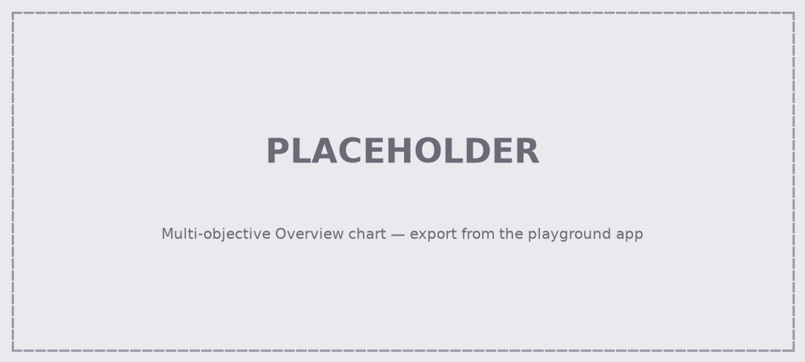

# The Location Optimization Playground

## The scenario

You are a senior manager who has been given funding for **one additional community diagnostic centre** in Devon.

::: {style="font-size: 85%;"}

- You have been told to improve access for those aged **50 to 84**
- ...and to prioritise improving it for the **most deprived areas**
- There are **4 existing centres**, and **14 possible sites** for the new one
- People may only use centres **within Devon** — they can't cross the border

:::

::: {.fragment}

You have been assigned a rather junior analyst.

They can get you information — but they can only follow very specific instructions, and their time is not unlimited.

:::

## How this works

:::: {.columns}

::: {.column width='50%'}

::: {.value-box icon="fa-solid fa-magnifying-glass"}

Take the time to explore the maps.

:::

:::

::: {.column width='50%'}

::: {.value-box icon="fa-solid fa-lightbulb"}

Don't worry about getting the "right" answer.

:::

:::

::::

::: {style="font-size: 85%;"}

You'll be asked to pick a site as you go. That's deliberate — **go with your gut each time**, and don't go back and tidy up your earlier answers.

:::

# Debrief

## So — where did you land?

:::: {.columns}

::: {.column width='50%'}

::: {.value-box icon="fa-solid fa-location-dot"}
Which site did your group choose?
:::

::: {.value-box icon="fa-solid fa-folder-open"}
Which briefings did you spend your time on?
:::

:::

::: {.column width='50%'}

::: {.value-box icon="fa-solid fa-arrows-rotate"}
Did your answer change as you went?
:::

::: {.value-box icon="fa-solid fa-circle-question"}
What didn't you buy — and would it have changed your mind?
:::

:::

::::

## You didn't disagree because somebody was wrong

There were **11** analyses your analyst could have run. You had **6** briefings.

::: {.fragment}

So no two groups looked at the same evidence.

:::

::: {.fragment}

And every one of those analyses answers a [**different question**]{style="color:yellow"}.

:::

::: {.fragment}

::: {.value-box}
Different evidence, different question, different site.

Nobody made a mistake.
:::

:::

## What the optimiser found

<!-- TODO: replace with the Multi-objective Overview chart from the app -->
{height=400}

::: {style="font-size: 80%;"}

It compared **all 14 combinations** against **5 different measures**.

Several of them are *defensible* — nothing else beats them across the board. **Each one is the best answer to a different question.**

:::

## Then they found £5m down the back of the sofa

Funding for a **second** centre. 14 options becomes [**91**]{style="color:yellow"}.

::: {.fragment}

So we just open the two best sites from last time?

:::

::: {.fragment}

::: {.value-box value="Sometimes"}

Sites compete for the same patients — so the best **pair** isn't always your two best **singles**.

Here they happen to match on most measures. But not on **worst-case journey time**, where the best pair is a different one entirely.

:::

:::

## The bit that actually matters

> "I can just change one parameter and rerun it. Give me five minutes."

::: {.fragment}

Once the model exists, new questions are [**cheap**]{style="color:yellow"}.

The expensive part is building it *once*.

:::

::: {.fragment}

::: {.value-box}
That's what an HSMA project buys you — not one answer, but the ability to keep asking.
:::

:::
