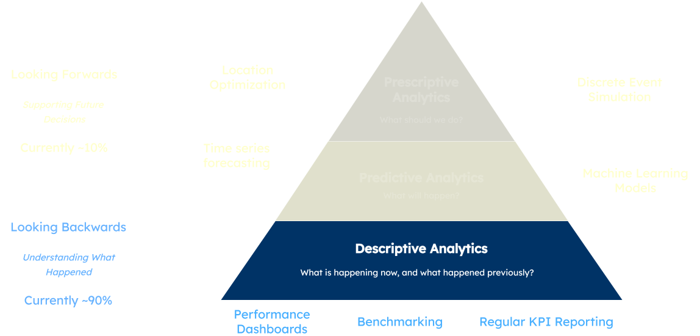
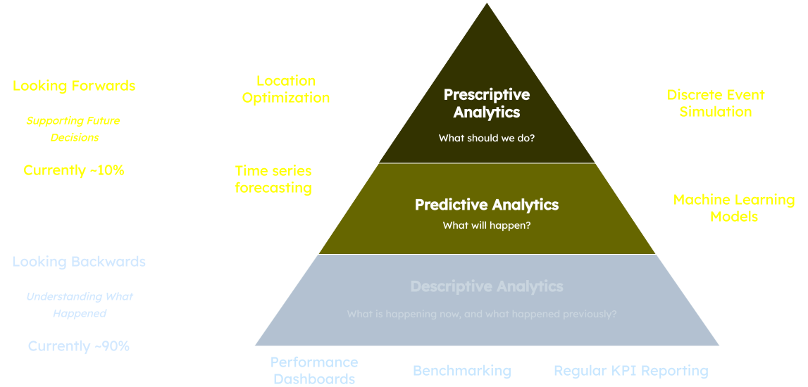
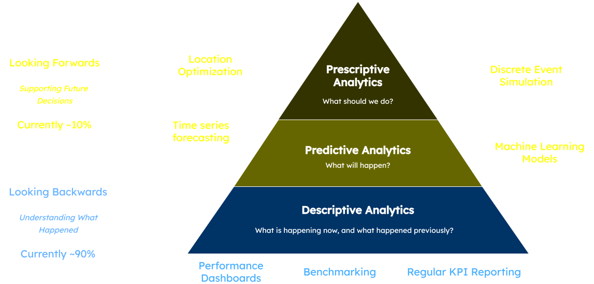

# An Intro to Operational Research and Data Science

Before we talk too much about the impressive things we can do, you need to understand some core concepts.

## {.slide data-menu-title="Operational Research and Data Science"}

:::: {.columns}

::: {.column width='50%'}

### Operational Research

:::

::: {.column width='50%'}

### Data Science

:::

::::

:::: {.columns}

::: {.column width='50%'}

::: {.fragment .fade-in-then-semi-out}

Applying modelling, simulation and analysis techniques to help inform
decisions and improve decision making.

:::

:::

::: {.column width='50%'}

::: {.fragment .fade-in-then-semi-out}

Using methods from machine learning, statistics, data mining and data analysis to generate insights from data.

:::

:::

::::

:::: {.columns}

::: {.column width='50%'}

::: {.fragment .fade-in-then-semi-out}

We start with a [**system and/or process**]{style="color:yellow"}

:::

:::

::: {.column width='50%'}

::: {.fragment .fade-in-then-semi-out}

We start with the [**data**]{style="color:yellow"}

:::

:::

::::

:::: {.columns}

::: {.column width='50%'}

::: {.fragment .fade-in-then-semi-out}

We use data to parameterise a model to emulate the system/process in-silico.

:::

:::

::: {.column width='50%'}

::: {.fragment .fade-in-then-semi-out}

We use techniques to explore hidden patterns and structures in the data to gain new insights.

:::

:::

::::

## OR vs DS Fight

:::: {.columns}

::: {.column width='50%'}

::: {.value-box style="font-size: 5rem;"}
“We have lots of data on readmissions.

Can we teach a machine to automatically identify which patients are likely to be readmitted?”
:::

{height=250px}

:::

::: {.column width='50%'}

::: {.value-box style="font-size: 5rem;"}
“We want to make these changes to our process for triaging patients.

What do we predict the impact will be?

What resources will we need to ensure the process is efficient?”

:::

{height=200px}

:::

::::

::: {.fragment}

:::: {.columns}

::: {.column width='50%'}

Hat Dan is talking about [data science]{style="color:yellow"}

:::

::: {.column width='50%'}

Fonz Dan is talking about [operational research]{style="color:yellow"}

:::

::::

:::

## The benefits of modelling

:::: {.columns}

::: {.column width='50%'}

::: {.fragment}

::: {.value-box .bg-light-blue style="font-size: 1.25rem;"}

**Emulation**

A model is a version of reality that can be altered [**without risk**]{style="color:yellow"} or consequence.

:::

:::

:::

::: {.column width='50%'}

::: {.fragment}

::: {.value-box .bg-light-blue style="font-size: 1.25rem;"}

**Communication**

A model can help people communicate about a problem using a [**shared language**]{style="color:yellow"} and point of reference.

:::

:::

:::

::::

:::: {.columns}

::: {.column width='50%'}

::: {.fragment}

::: {.value-box .bg-light-blue style="font-size: 1.25rem;"}

**Speed**

Typically, models can be designed and built much [**more quickly**]{style="color:yellow"} than real world changes can be put into place.

:::

:::

:::

::: {.column width='50%'}

::: {.fragment}

::: {.value-box .bg-light-blue style="font-size: 1.25rem;"}

**Systems Thinking**

The process of designing the model can help people to [**think about their systems**]{style="color:yellow"}.

:::

:::

:::

::::

::: {.fragment}

::: {.value-box .bg-light-blue style="font-size: 1.2rem;"}

**Objectivity**

A model can provide [**objective**]{style="color:yellow"} support for an argument.

Assuming it’s been built objectively, of course…

:::

:::

## "What if?" analysis

Modelling allows us to undertake something known as “what if?” analysis.

:::: {.columns}

::: {.column width='50%'}

::: {.value-box}

### Base Case

This represents our system as it is.

This allows us to see what’s happening now, validate the model and help identify what we might want to think about changing.

:::

:::

::: {.column width='50%'}

::: {.value-box}

### "What If" Analysis?

This allows us to test scenarios in the model, deviating from our base case to see what the impact might be if we changed x, y or z.

:::

:::

::::

## {.slide data-menu-title='"What if?" analysis - kinds of questions'}

::: {.value-box icon="bi bi-clock-fill" align="center" icon-size="1.5em" fragment="true"}
What if I changed the opening times?
:::

::: {.value-box icon="bi bi-arrow-down-up" align="center" icon-size="1.5em" fragment="true"}
What if I moved resource from this part of the pathway to another?
:::

::: {.value-box icon="bi bi-people-fill" align="center" icon-size="1.5em" fragment="true"}
What if demand increased by 10%?
:::

::: {.value-box icon="bi bi-hospital" align="center" icon-size="1.5em" fragment="true"}
What if we opened a new site here?
:::

## OR, DS and Analytics

::: {.value-box icon="fa-solid fa-backward" align="center"}

In our experience, the NHS typically spends about 90% of its analytical capability on looking at **right now** or **backwards**

:::

:::: {.columns}

::: {.column width='50%'}

::: {.fragment}
What's the status of this service **today**?
:::

:::

::: {.column width='50%'}

::: {.fragment}
How did we do last week/month?
:::

:::

::::

## The Analytics Pyramid

## What HSMA Builds To

## The full picture

## Discussion

Where do you feel like your organisation is in this progression?

:::: {.columns}

::: {.column width='50%'}
- Do you know if you have someone with the job title 'data scientist' or something similar?
:::

::: {.column width='50%'}

:::

::::
