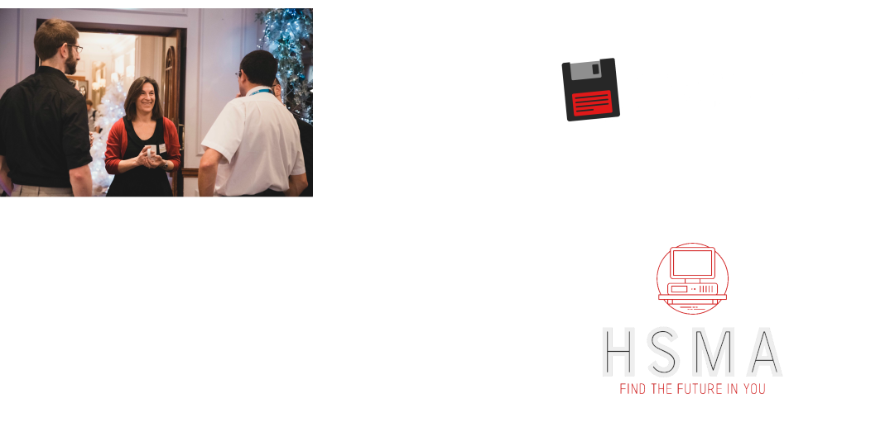

# Welcome!

## Boot Disk

Before we introduce ourselves, let’s take a bit of time to hear from you:

:::: {.columns}

::: {.column width='50%'}
- Name
- Role
- Organisation
:::

::: {.column width='50%'}

:::

::::

## A few questions...

<iframe sandbox='allow-popups allow-scripts allow-same-origin allow-presentation' allowfullscreen='true' allowtransparency='true' frameborder='0' height='315' src='https://www.mentimeter.com/app/presentation/aluunihvprf397pddmjcqf1ypxk449or/embed' style='position: absolute; top: 0; left: 0; width: 100%; height: 450px;' width='420'></iframe>

## Who am I?

:::: {.columns}

::: {.column width='40%'}

:::

::: {.column width='60%'}

:::{.focus-list}
- Ex NHS data scientist
- MSc health data science, 2021
- Postdoctoral research fellow for 3 years
- Author of software for simulation visualisation and geographic optimization
:::

:::

::::

## A bit about PenARC

:::{.focus-list}
- NIHR Applied Research Collaboration (ARC) for the South West
- National partnerships between academia and NHS
- Undertake collaborative, applied research that makes a real impact
    - Measured on the impact we generate
- We sit across the Universities of Exeter, Plymouth and Bristol
:::

## What is HSMA?

The **Health Service Modelling Associates (HSMA) Programme**

::: {.fragment .fade-in}
1 day a week for 15 months
:::

 

:::: {.columns}

::: {.column width='50%'}

::: {.value-box align="center" icon="fa-solid fa-school" fragment=".fade-left"}
 

### 6 MONTHS

Extensive training course teaching programming, Operational Research (OR) and Data Science Methods
:::

:::

::: {.column width='50%'}

::: {.value-box align="center" icon="fa-solid fa-laptop-code" fragment=".fade-right"}
 

### 9 MONTHS

Apply skills to a project of importance for their organisation with mentoring and guidance from us
:::

:::

::::

## There is such a thing as a free lunch?

:::: {.columns}

::: {.column width='50%'}

::: {.value-box fragment=".fade-in" icon="fa-solid fa-sterling-sign" align="center"}
Offered **free of charge**
:::

:::

::: {.column width='50%'}

::: {.value-box fragment=".fade-in" icon="fa-brands fa-python" align="center"}
Teaches entirely Free and Open Source approaches

So no ongoing software licencing costs!
:::

:::

::::

## HSMA Impact

Over the last [10 years]{style="font-size: 150%;"}...

:::{.fragment}

we have taught [over 450 students]{style="font-size: 150%;"}...

:::

:::{.fragment}

from [over 100 organisations]{style="font-size: 150%;"} nationally

:::

## HSMA Impact Stories

:::: {.columns}

::: {.column width='50%'}

::: {.value-box .bg-light-blue style="font-size: 1.25rem;" icon="fa-solid fa-money-bill" icon-position="left" fragment="true" icon-size="1.5em"}

**Supporting multi million £ business cases**

An early HSMA project was instrumental in obtaining capital funding for for a new facility, reducing patients in crisis being sent out of area at significant cost and away from support networks

:::

::: {.value-box .bg-light-blue style="font-size: 1.25rem;" icon-position="left" icon="fa-solid fa-arrows-split-up-and-left" fragment="true" icon-size="1.5em"}

**Improving Performance**

What-if analysis allowed a HSMA team to work out how to redesign pathways to improve urgent care flow, improving patient and staff experience

:::

:::

::: {.column width='50%'}

::: {.value-box .bg-light-blue style="font-size: 1.25rem;" fragment="true" icon-position="left" icon="fa-solid fa-syringe" icon-size="1.5em"}

**Ensuring patient safety**

A GP used simulation modelling to identify issues with COVID vaccine rollout plans in their area - the week after learning it on the programme

:::

::: {.value-box .bg-light-blue style="font-size: 1.25rem;" fragment="true" icon-position="left" icon="fa-solid fa-hospital" icon-size="1.5em"}

**Driving better outcomes while saving money**

A recent HSMA project identified £500k+ cost saving opportunities in stroke care while reducing disability and helping patients be discharged faster

:::

:::

::::

::: {.value-box .bg-light-blue style="font-size: 1.25rem;" fragment="true" icon-position="left" icon="fa-solid fa-clock" icon-size="1.5em"}

**Helping Shorten Waits**

A previous project helped to identify strategies to reduce rheumatology patient waiting times by 10 weeks within 5 years

:::

## Wider HSMA Impact

:::: {.columns}

::: {.column width='50%'}

::: {.value-box .bg-light-blue style="font-size: 1.25rem;" icon-size="3em" icon="fa-solid fa-house"  align="center" fragment=".fade-left"}

 

### In-house capacity building

New data teams developed with HSMAs can manage complex projects that were previously only achievable with consultancy support

:::

:::

::: {.column width='50%'}

::: {.value-box .bg-light-blue style="font-size: 1.25rem;" icon-size="3em" icon="fa-solid fa-user-graduate"  align="center" fragment=".fade-right"}

 

### Preparing Staff for their Next Steps

HSMAs are given the skills and confidence to pursue further education, with some alumni taking on MSc degrees in health data science to continue honing their skills

:::

:::

::::

::: {.value-box .bg-light-blue style="font-size: 1.25rem;" icon-size="3em" icon="fa-solid fa-group"  align="center" fragment=".fade-right"}

 

### Lifelong Access to a Community

HSMAs gain lifelong access to an alumni community of over 450 people who've been through the programme

:::

## HSMA Approach to Teaching

We’re teaching you complex, valuable stuff in a (hopefully) fun and lighthearted way

:::: {.columns}

::: {.column width='40%'}

:::

::: {.column width='60%'}

:::{.focus-list}
- We spend far too much of our lives being very serious
- I could give you a very dry lecture for three hours
:::

:::

::::

::: {.focus-list}
- But you’ll actually learn and remember more this way
- We respect your time in coming here today; we’re here to deliver serious learning, sometimes unseriously
:::

# HSMA Lambda

## What is HSMA Lambda?

A series of **standalone workshops** targeted at **decision makers** in the health service

Each workshop focuses on a **different** modelling or data science approach

:::: {.columns}

::: {.column width='33%'}

::: {.value-box icon="fa-solid fa-children" icon-position="top" align="center"}

 

### Simulation for Pathway Problems

How can simulation modelling help improve patient flow and reduce waits?

:::

:::

::: {.column width='33%'}

::: {.value-box icon="fa-solid fa-map-location-dot" icon-position="top" align="center"}

 

### Mapping and Modelling for Location Problems (today!)

How can we use maps and optimization to make data-driven, fairer decisions about services?

:::

:::

::: {.column width='33%'}

::: {.value-box icon="fa-solid fa-brain" icon-position="top" align="center"}

 

### Machine Learning for Operational Enhancements

How can we use machine learning for improving the efficiency of our services?

:::

:::

::::

## Today's Goals

:::: {.columns}

::: {.column width='50%'}

::: {.fragment}

::: {.value-box .bg-light-blue style="font-size: 1.25rem;" align="center"}

**What questions can these methods be used to answer?**

:::

:::

::: {.fragment}

::: {.value-box .bg-light-blue style="font-size: 1.25rem;" align="center"}

**How do the methods work (at a high level)?**

:::

:::

::: {.fragment}

::: {.value-box .bg-light-blue style="font-size: 1.25rem;" align="center"}

**How do I interact with and interpret these models?**

:::

:::

:::

::: {.column width='50%'}

::: {.fragment}

::: {.value-box .bg-light-blue style="font-size: 1.25rem;" align="center"}

**What problems in my own organisation can be answered with these?**

:::

:::

::: {.fragment}

::: {.value-box .bg-light-blue style="font-size: 1.25rem;" align="center"}

**What can we tackle together?**

:::

:::

::: {.fragment}

::: {.value-box .bg-light-blue style="font-size: 1.25rem;" align="center"}

**Who can I send from my organisation to learn the skills to answer this question?**

:::

:::

:::

::::

::: {.fragment}

By the end of today, you'll leave today with structured questions to form the basis of future HSMA projects

:::

## The Lambda pathway

:::: {.columns}

::: {.column width='70%'}

:::

::::

## The HSMA pathway

:::: {.columns}

::: {.column width='90%'}

:::

::::
