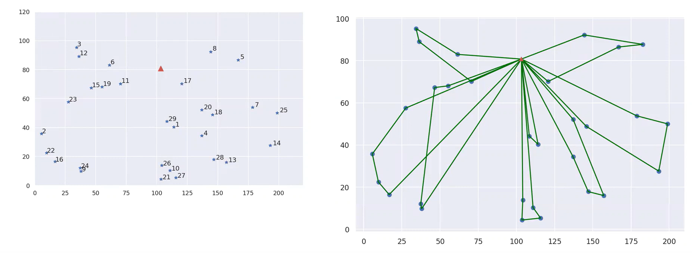
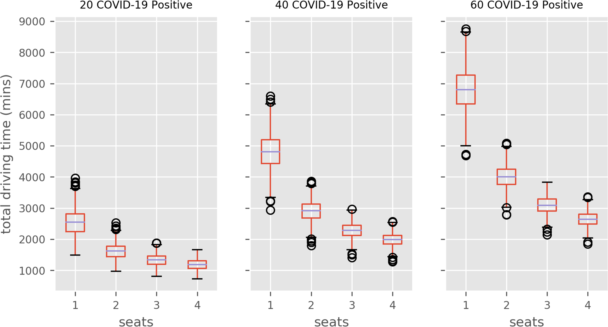
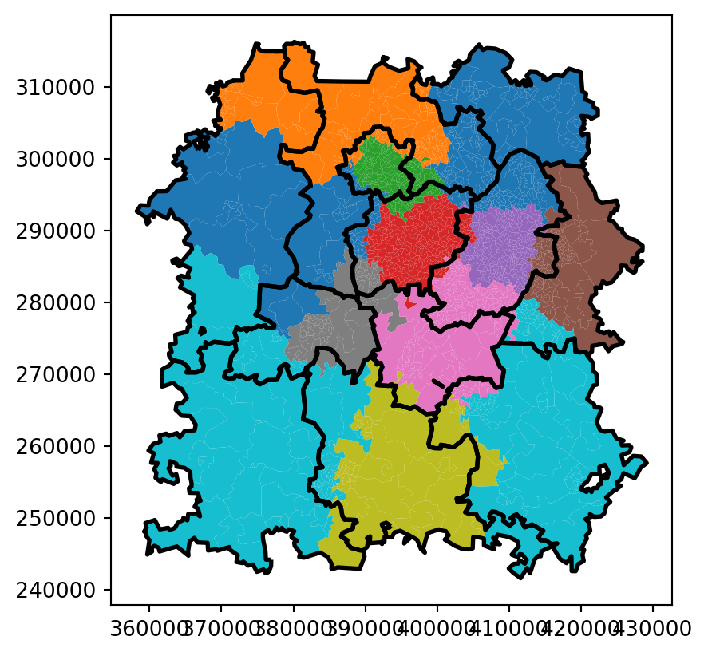

# Other Techniques

There are a few things we don't teach and directly support on HSMA, but that HSMAs may be able to build up to using their geographic foundations.

We can support projects in these areas - but be aware that we might be bit more limited in the depth of advice we can provide.

## Routing and Scheduling

:::: {.columns}

::: {.column width='50%'}

:::

::: {.column width='50%'}
Most of us primarily encounter routing and scheduling in the context of parcel deliveries!

But there are potential applications in health data science projects too.
:::

::::

## Efficient Routes

:::: {.columns}

::: {.column width='50%'}

You may have heard of the 'travelling salesman problem' - where the goal is to find the most efficient route between a series of points.

This is actually a hard problem for computers to solve as the number of points increases - and even more so when you expand it to multiple vehicles (e.g. community nurses) with constraints (e.g. patient continuity, different skill mixes).

But computers are, overall, better at it than humans - and can do it at scale, automatically.

:::

::: {.column width='50%'}

:::

::::

## Don'ts of Routing Projects

While you *could* set up a project that will route your community nurses efficiently every day - we'd advise against it.

These kinds of tools are deceptively complex to create, particularly to ensure they run day in, day out, taking into account enough operational nuances.

This is one of the few places we would say 'leave it to the software comparies'.

## Do's of Routing Projects

But routing and scheduling can still have a place in service improvement projects!

Maybe you want to look at the value of moving some of your patient transport vehicles, or adding another one.

Routing often pairs well with simulation for this kind of purpose - a technique we teach in another of our lambda workshops, and which students also learn on HSMA.

## PenCHORD Project Showcase - Dialysis Transport during COVID-19

This PenCHORD project was tasked with making sure dialysis transport could continue safely and efficiently during the COVID-19 Pandemic.

By combining simulation of patient disease status with routing, they were able to show the impact of different patients-per-vehicle limits on overall driving time required.

## PenCHORD Project Showcase - Dialysis Transport during COVID-19

Modelling multiple disease spread scenarios, they were able to show a significant reduction in travel hours required by relaxing policies to allow two patients to travel in the same vehicle simultaneously, balancing infection control needs with limited resource and essential treatments.

## Boundary Optimization

Boundaries appear frequently in healthcare services.

Perhaps you use them to determine which of several sub-teams a patient will be allocated to when they are referred - e.g. for community physio teams, or community mental healthcare or crisis care.

:::: {.columns}

::: {.column width='33%'}
::: {.value-box}
But how were those boundaries drawn?

:::
:::

::: {.column width='33%'}
::: {.value-box}
Are they actually dividing work in a fair and efficient way?

:::
:::

::: {.column width='33%'}
::: {.value-box}
When were they last updated?
:::
:::

::::

## Boundary Optimization

:::: {.columns}

::: {.column width='50%'}
Boundary optimization algorithms, a bit like location optimization - can help you redraw boundaries in a way that is fairer.

They can try out hundreds of thousands of combinations, scoring against metrics like balance of assigned workload across regions, or how much the region differs from an ideal workload per team.

:::

::: {.column width='50%'}

:::

::::

## HSMA Project Showcase - Boundary Optimization for North West Ambulance Service

:::: {.columns}

::: {.column width='50%'}

The North West Ambulance service used advanced location optimization approaches to update historic ambulance dispatch boundaries, which were now imbalanced and inefficient after population shifts since their original setup.

:::

::: {.column width='50%'}

:::

::::
